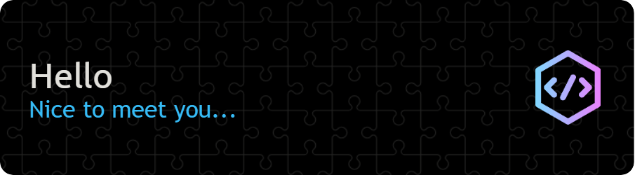

 

## Overview

- 🔭 I’m currently working on my personal project.
- 🌱 I’m currently learning SQL.
- 👨‍💻 Next on my learning list: PostgreSQL, AWS S3 .NET and so on.
- 💡 Fun fact: When I don't have any problem, I create one just to dive into problem-solving!

## Tech Stack

  
  
  
  
  
  
  
  
  
  
  
  
  
  
  
  
  
  
  
  

  <!-- Add line break here -->

## Current Stats

  

